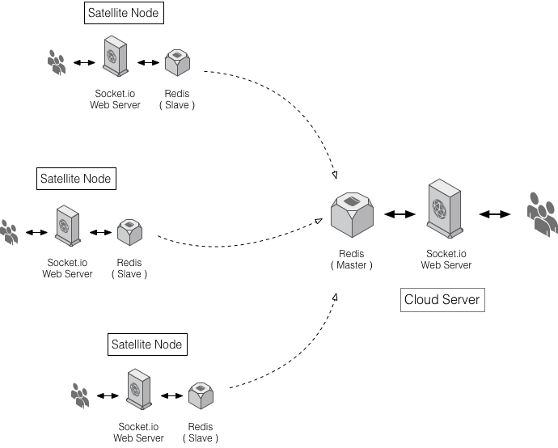

# Drchat

### 简介

Drchat 共分成2个部分，一部分是 Server 端，一部分是 Client 端，共同完成一个基于微信通信的聊天软件

### Client 端
[Client](https://github.com/playniuniu/drchat_client) 端采用 [Framework7](http://framework7.taobao.org) 做为界面，采用 [Socket.io](http://socket.io) 做 Websocket，实现通信

### Server 端

[Server](https://github.com/playniuniu/drchat_server) 端采用 [python-socketio](https://python-socketio.readthedocs.org) 作为 Server，后台使用了 [redis](http://redis.io/) 支撑消息服务, 详细说明见 [这里](http://socket.io/docs/rooms-and-namespaces/#sending-messages-from-the-outside-world), 对于 python-socketio 参见 [这里](http://python-socketio.readthedocs.org/)

### 系统架构


这里有一下几点需要注意：

- 整个后台的 Redis 服务，由云端 redis 支撑，其余所有 redis 都与其同步
- socketio server 负责从 redis 读取消息并发送用户
- socketio server 同时包含了一个 REST API，用于用户登录，消息记录等
- socketio server 最终由 supervisor 负责启动和监管

### Server 端安装

本程序采用 Python3, 依赖于 requirements.txt, redis-server, supervisor

- 使用 virtualenv 配置 python 运行环境，并使用 ```pip install -r requirements.txt``` 安装相应包
- 安装 redis 和 supervisor ``` sudo apt-get install redis-server supervisor```
- 将 resource 文件夹中的配置文件，根据服务类型，依次拷贝并作相应修改
- 开启 sockeio server, 在 virtualenv 模式下运行 ```python run.py``` 测试服务运行情况
- 重启计算机，看 supervisor 是否正确配置并运行
